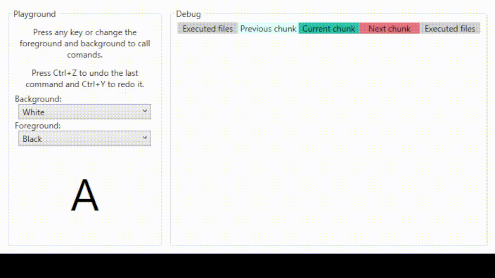

# wpf-command-pattern

Implementation of Command Design Pattern for WPF projects.

It offers some Command managers to manage the memmory in a way that better suits the proyect. 
* CommandManager: Standard implementation of two executed/undone commands stacks.
* CappedCountCommandManager: Like CommandManager but with maximum executed commands stored in the stack.
* DiskCommandManager: Is able to store commands on disk. It sets a maximum size for the stacks in memory and saves on disk the ones that are not needed, loading them when it has to.

